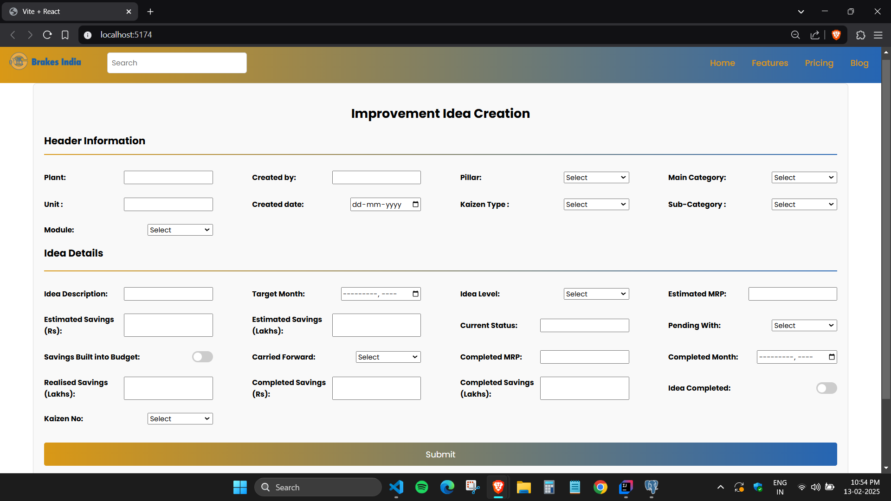

# 💡 Improvement Idea Web Application  

A web-based platform for submitting improvement ideas, built with **React**, **Spring Boot**, and **PostgreSQL**. Currently, it supports **data submission**, with future plans to include **search, update, and delete functionalities**.  

---

## 📋 Features  
- ✅ **React frontend** for intuitive user experience  
- ✅ **Spring Boot backend** for handling API requests  
- ✅ **PostgreSQL database** for storing submitted ideas  
- ✅ **RESTful API** for seamless data exchange  
- 🚀 **Future Enhancements**: Search, Update, and Delete  

---

## 🛠 Prerequisites  
Ensure you have the following installed before running the project:  

- **Java 17+** → [Download](https://adoptium.net/)  
- **PostgreSQL** → [Download](https://www.postgresql.org/download/)  
- **Node.js & npm** → [Download](https://nodejs.org/)  
- **Spring Boot** CLI (Optional) → [Guide](https://spring.io/guides/gs/spring-boot/)  
- **Postman** (For API testing) → [Download](https://www.postman.com/downloads/)  

---

## 🚀 Installation & Setup  

### 🔹 Step 1: Clone the Repository  
```sh
git clone https://github.com/Sandeep-G-S/Improvement-Idea-WebApp.git
cd Improvement-Idea-WebApp
```

### 🔹 Step 2: Configure the Database  
1. Open **PostgreSQL** and create a new database:  
   ```sql
   CREATE DATABASE improvement_ideas;
   ```
2. Update **application.properties** with your database details:  
   ```properties
   spring.datasource.url=jdbc:postgresql://localhost:5432/improvement_ideas
   spring.datasource.username=your_username
   spring.datasource.password=your_password
   ```

### 🔹 Step 3: Run the Backend  
```sh
cd backend
mvn spring-boot:run
```
The backend will start at **http://localhost:8080** 🚀  

### 🔹 Step 4: Run the Frontend  
```sh
cd frontend
npm install
npm start
```
The frontend will start at **http://localhost:3000** 🎨  

---

## 📷 Screenshots  
(Add screenshots once the UI is ready!)  

| **Submit Idea** |
|--------------|
|  |

---

## 🔗 Future Enhancements  
- 🔍 **Search & Filter Ideas**  
- ✏️ **Edit & Update Submissions**  
- 🗑 **Delete Ideas**  
- 📊 **Admin Dashboard for Idea Management**  

---

